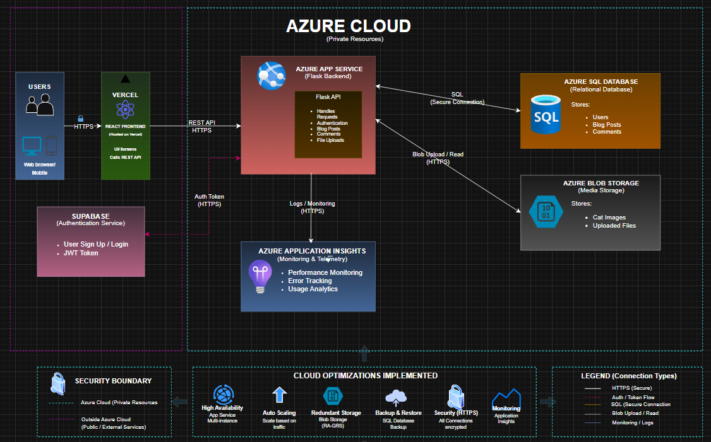

# 🐾 NyanScape

NyanScape is a cloud-based cat community web application developed as a final project for our Cloud Computing course. The platform allows users to register, upload cat photos, interact with posts through likes and comments, and explore content shared by the community.

The project uses a multi-cloud architecture with Microsoft Azure, Supabase, and Vercel to demonstrate cloud deployment, storage management, authentication, monitoring, and CI/CD integration.

---

## 🌐 Live Demo

- Frontend: https://nyan-scape.vercel.app
- Repository: https://github.com/pau-827/NyanScape
- Recorded Video: https://youtu.be/mwWBcOYhaj0?si=HcRR79PNYe7Yusjt

---

## ☁️ Cloud Architecture

NyanScape follows a multi-cloud deployment architecture:

- **Frontend** hosted on Vercel
- **Backend API** hosted on Microsoft Azure App Service
- **Image Storage** handled by Azure Blob Storage
- **Monitoring & Telemetry** using Azure Application Insights
- **Database & Authentication** powered by Supabase PostgreSQL and Supabase Auth
- **CI/CD Pipeline** automated through GitHub Actions

---

### Azure Architecture Diagram

---



---

## 🚀 Features

### Implemented Features

- User Registration and Login
- Supabase Authentication
- Upload Cat Images
- Community Feed
- Like and Unlike Posts
- Comments System
- User Profile Page
- Explore Page
- Notification Page UI
- Messaging Page UI
- Responsive Authentication Layout
- Azure Blob Image Upload Integration
- Real-Time Backend Integration

---

## 🛠️ Tech Stack

### Frontend
- React
- Vite
- Axios
- CSS

### Backend
- Flask
- Flask-CORS
- Gunicorn
- Python 3.11

### Cloud & Database Services
- Microsoft Azure App Service
- Azure Blob Storage
- Azure Application Insights
- Supabase PostgreSQL
- Supabase Authentication
- Vercel
- GitHub Actions

---

## 📂 Project Structure

```txt
nyanscape/
├── diagram/
├── deployment/
├── report/
├── backend/
├── frontend/
├── CHANGELOG.md
└── README.md
```

---

## 📦 Backend Structure

```txt
backend/
├── config/
├── models/
├── routes/
├── app.py
├── .env
└── requirements.txt
```

### Backend Routes

- `auth.py` → login, signup, logout
- `posts.py` → create, read, delete posts
- `likes.py` → like/unlike system
- `comments.py` → comment management

---

## 🎨 Frontend Structure

```txt
frontend/nyan-scape/
├── public/
├── src/
│   ├── assets/
│   ├── components/
│   ├── pages/
│   ├── App.jsx
│   └── main.jsx
└── package.json
```

---

## ⚙️ Environment Variables

### Backend `.env`

```env
SUPABASE_URL=
SUPABASE_ANON_KEY=
SUPABASE_SERVICE_ROLE_KEY=
AZURE_STORAGE_CONNECTION_STRING=
AZURE_STORAGE_CONTAINER=
```

### Frontend `.env`

```env
VITE_SUPABASE_URL=
VITE_SUPABASE_ANON_KEY=
VITE_API_URL=
```

---

## ▶️ Running the Project Locally

### 1. Clone the Repository

```bash
git clone https://github.com/pau-827/NyanScape.git
cd NyanScape
```

---

### 2. Backend Setup

```bash
cd backend

python -m venv venv

# Windows
venv\Scripts\activate

# Linux / Mac
source venv/bin/activate

pip install -r requirements.txt

flask run

or 

python app.py
```

The backend server will run on:

```txt
http://127.0.0.1:5000
```

---

### 3. Frontend Setup

```bash
cd frontend/nyan-scape

npm install

npm run dev
```

The frontend server will run on:

```txt
http://localhost:5173
```

---

## ☁️ Azure Services Used

| Service | Purpose |
|---|---|
| Azure App Service | Hosts Flask backend API |
| Azure Blob Storage | Stores uploaded cat images |
| Azure Application Insights | Backend monitoring & telemetry |
| Supabase PostgreSQL | Database |
| Supabase Auth | User authentication |
| Vercel | Frontend hosting |
| GitHub Actions | CI/CD automation |

---

## 🔄 CI/CD Workflow

### Backend Deployment

```txt
Developer Push → GitHub Repository
                ↓
        GitHub Actions CI/CD
                ↓
 Azure App Service Deployment
                ↓
 Flask Backend Live
```

### Frontend Deployment

```txt
Developer Push → GitHub Repository
                ↓
        Vercel Auto Deployment
                ↓
         Frontend Goes Live
```

---

## 📊 Azure Resources

### Resource Group
- `rg-nyanscape`

### App Service
- `nyanscape-backend`

### Blob Storage Container
- `cat-images`

### Monitoring
- Azure Application Insights

---

## 📸 Deployment Documentation

Deployment screenshots and cloud setup documentation are available in:

```txt
deployment/README.md
```

This includes:
- Resource Group setup
- Azure Storage configuration
- Blob container setup
- App Service deployment
- Application Insights
- Supabase dashboard and tables
- Environment variables configuration

---

## 📈 Monitoring & Optimization

NyanScape implements two cloud optimizations:

1. **Azure Application Insights**
   - Real-time backend monitoring
   - Performance tracking
   - Error logging

2. **GitHub Actions CI/CD**
   - Automated backend deployment
   - Faster development workflow
   - Reduced manual deployment errors

---

## 🔮 Future Improvements

Planned future enhancements for NyanScape include:

- Azure AI Vision integration
- Automatic AI-generated hashtags
- Smart image categorization
- Enhanced recommendation system
- Improved real-time messaging
- Expanded social features

## 👥 Team

### Due-it Squad

- Ivy Pauline Muit
- Ayelyn Janne Panliboton
- Rhea Lizza Sanglay

---

## 📘 Course Information

- Course: Cloud Computing
- Project Type: Academic Final Project

---

## 📝 License

This project is intended for academic purposes only.

All Rights Reserved © Due-it Squad
