# ☁️ NyanScape Deployment Guide

This document contains the step-by-step deployment process for the NyanScape project, including Azure backend deployment, Supabase setup, GitHub Actions CI/CD integration, and Vercel frontend deployment.

---

# 📋 Prerequisites

Before deployment, make sure the following are installed and configured:

- Git
- Python 3.11
- Node.js & npm
- Azure Account
- Supabase Account
- GitHub Account
- Vercel Account

---

# 🗄️ Step 1 — Set Up Supabase

## 1.1 Create a Supabase Project

Open the Supabase dashboard and create a new project.

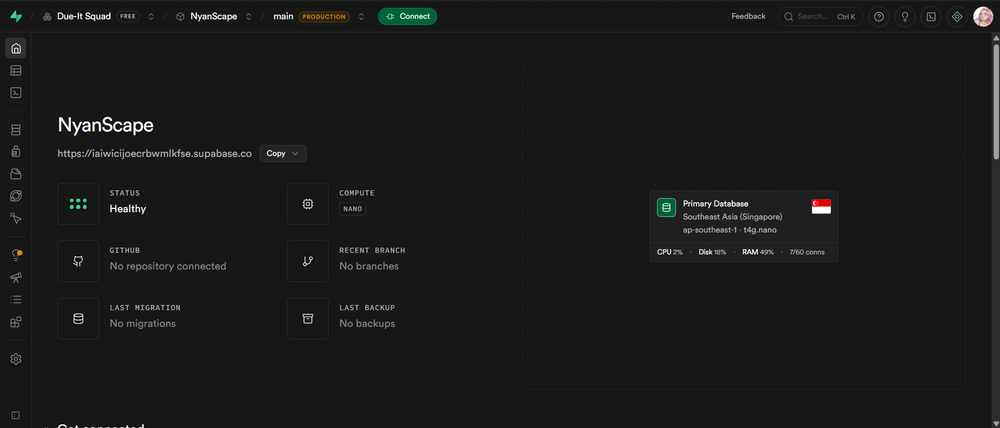

---

## 1.2 Create Database Tables

Create the following tables:

- profiles
- posts
- likes
- comments

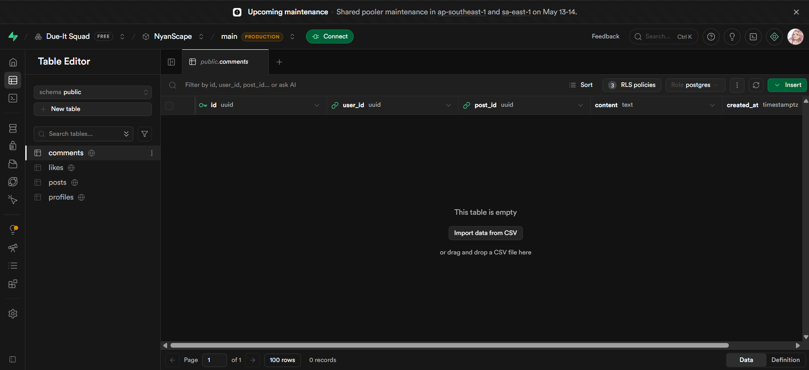

---

## 1.3 Configure Authentication

Enable email authentication inside Supabase Authentication settings.

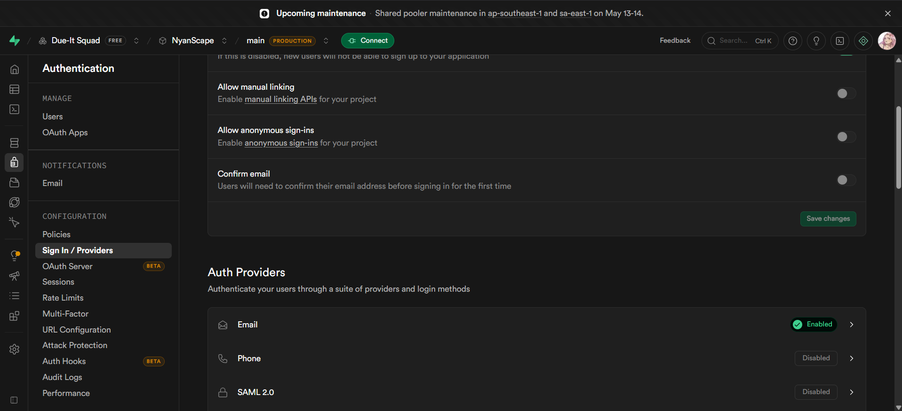

---

## 1.4 Obtain API Keys

Copy the following:

- Project URL
- anon public key
- service role key

These values will be used in the Flask backend environment variables.

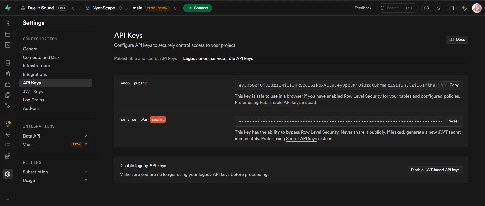

---

# ☁️ Step 2 — Create Azure Resources

---

## 2.1 Create Resource Group

Create a resource group named:

```txt
rg-nyanscape
```
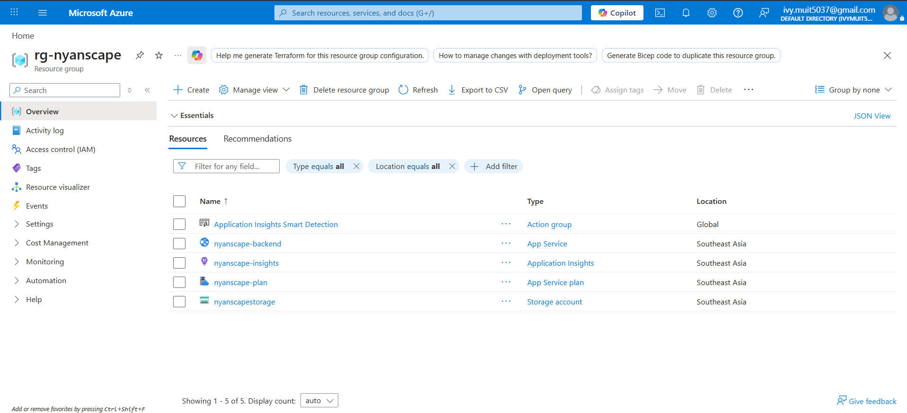

---

## 2.2 Create Azure Storage Account

Create a Storage Account for image uploads.

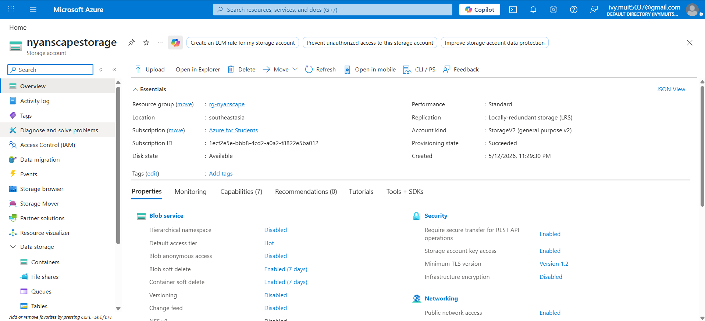

---

## 2.3 Create Blob Storage Container

Inside the Storage Account, create a blob container named:

```txt
cat-images
```

This container stores uploaded cat images.

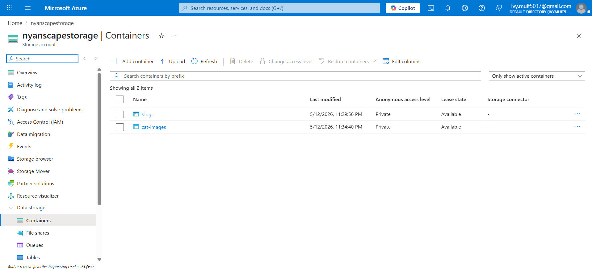

---

## 2.4 Create Azure App Service

Create a Web App using:

- Runtime: Python 3.11
- Operating System: Linux

App Service Name:

```txt
nyanscape-backend
```

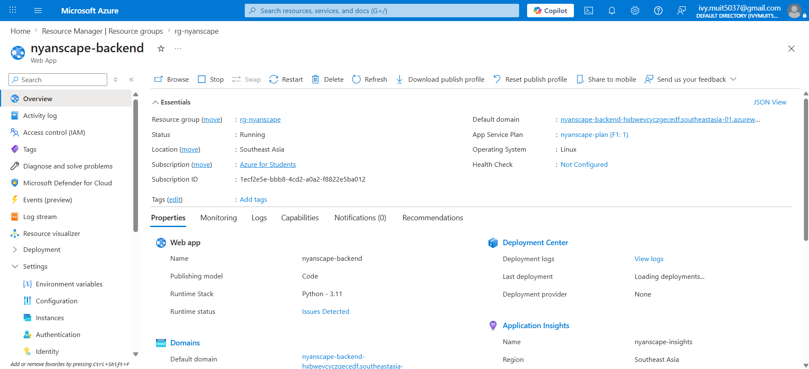

---

## 2.5 Enable Application Insights

Enable Azure Application Insights for monitoring and telemetry.

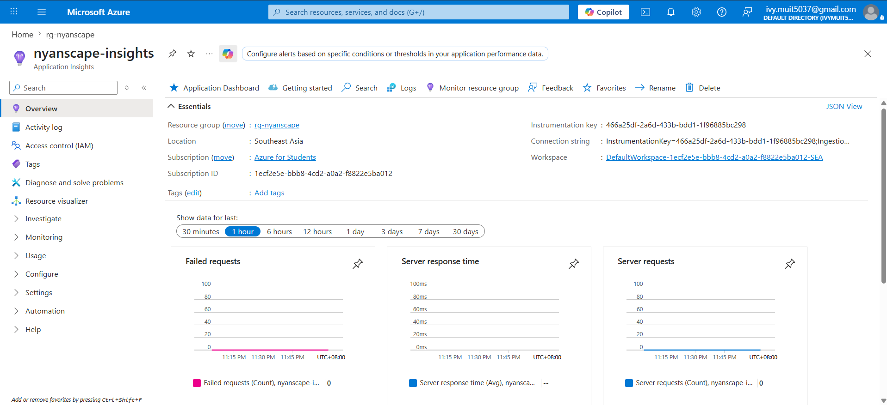

---

# 🔐 Step 3 — Configure Environment Variables

Inside Azure App Service → Environment Variables, configure the following:

```env
SUPABASE_URL=
SUPABASE_ANON_KEY=
SUPABASE_SERVICE_ROLE_KEY=
AZURE_STORAGE_CONNECTION_STRING=
AZURE_STORAGE_CONTAINER=
```

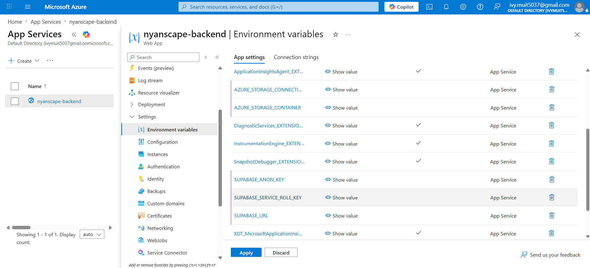

---

# 💻 Step 4 — Local Backend Setup

Navigate to the backend directory:

```bash
cd backend
```

Create virtual environment:

```bash
python -m venv venv
```

Activate virtual environment:

### Windows
```bash
venv\Scripts\activate
```

### Linux / Mac
```bash
source venv/bin/activate
```

Install dependencies:

```bash
pip install -r requirements.txt
```

Run Flask backend:

```bash
flask run

or

python app.py
```

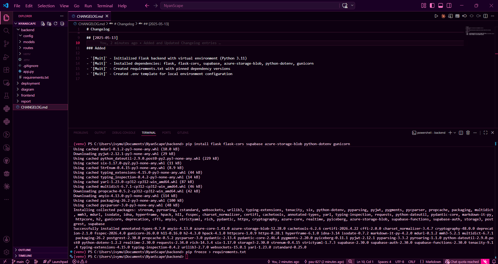

---

# 🚀 Step 5 — Deploy Backend to Azure

---

## 5.1 Open Deployment Center

Inside Azure App Service, open:

```txt
Deployment Center
```

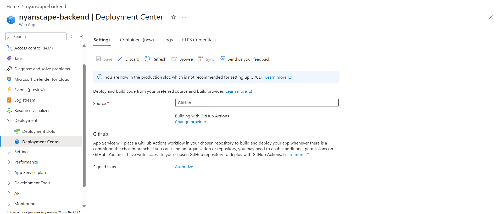

---

## 5.2 Authorize Azure with GitHub

Connect Azure App Service to GitHub.

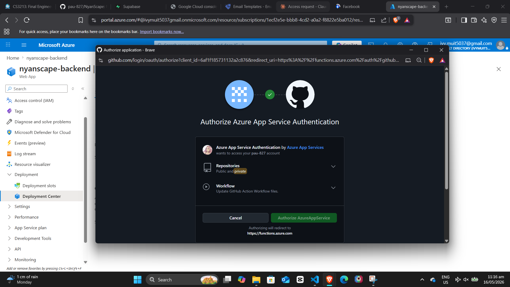

---

## 5.3 Configure GitHub Actions Deployment

Azure automatically generates a GitHub Actions workflow file for CI/CD deployment.

This enables automatic deployment whenever code is pushed to the repository.

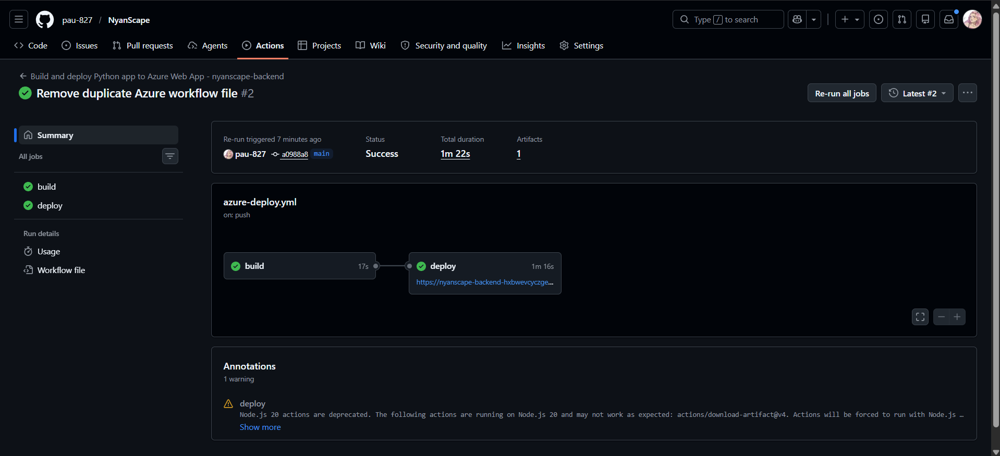

---

## 5.4 Verify Live Backend

After deployment completes successfully, open the backend URL to confirm the API is live.

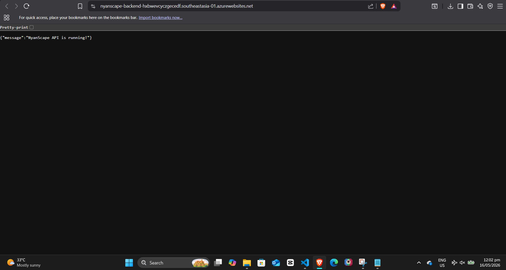

---

# 🌐 Step 6 — Deploy Frontend to Vercel

---

## 6.1 Authorize Vercel with GitHub

Log into Vercel and connect your GitHub account.

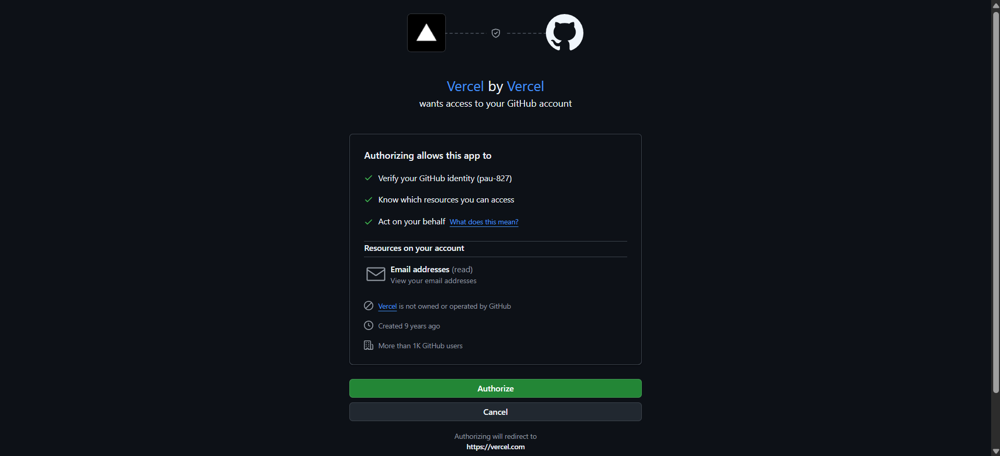

---

## 6.2 Configure Frontend Deployment

Import the React + Vite frontend project.

Set:

```txt
Framework: Vite
```

Configure:

```txt
Root Directory: frontend/nyan-scape
```
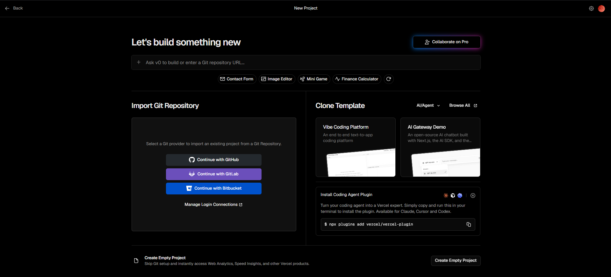
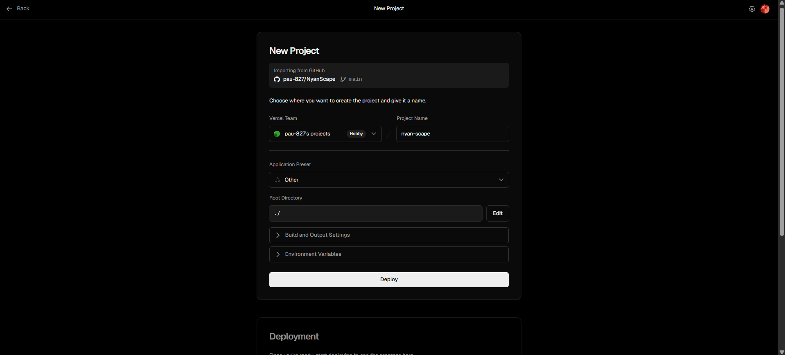

---

## 6.3 Deploy Frontend

Deploy the application to Vercel.

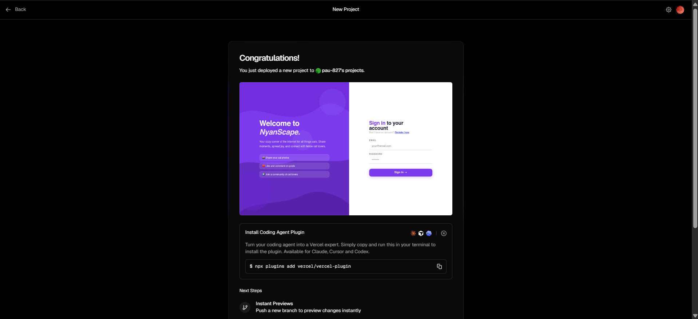

---

## 6.4 Verify Live Domain

After deployment completes successfully, verify the live Vercel domain.

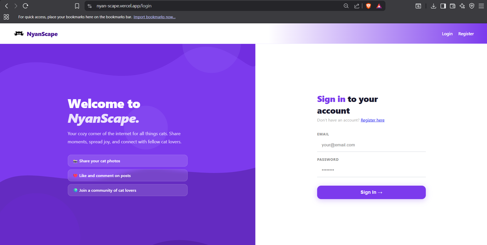

---

# 🔄 CI/CD Workflow

## Backend Deployment Flow

```txt
Developer Push → GitHub Repository
                ↓
        GitHub Actions CI/CD
                ↓
 Azure App Service Deployment
                ↓
 Flask Backend Live
```

---

## Frontend Deployment Flow

```txt
Developer Push → GitHub Repository
                ↓
      Vercel Automatic Deployment
                ↓
         Frontend Goes Live
```

---

# 📊 Cloud Services Used

| Service | Purpose |
|---|---|
| Azure App Service | Hosts Flask backend |
| Azure Blob Storage | Stores uploaded images |
| Azure Application Insights | Monitoring & telemetry |
| Supabase PostgreSQL | Database |
| Supabase Auth | Authentication |
| Vercel | Frontend hosting |
| GitHub Actions | CI/CD automation |

---

# 📈 Cloud Optimizations

## 1. Azure Application Insights
Used for:
- Backend monitoring
- Error tracking
- Performance analysis
- Telemetry

---

## 2. GitHub Actions CI/CD
Used for:
- Automatic deployment
- Faster development workflow
- Reduced manual deployment errors

---

# 🔮 Future Improvements

Planned future enhancements include:

- Azure AI Vision integration
- Automatic AI-generated hashtags
- Smart image categorization
- Enhanced recommendation system
- Improved real-time messaging
- Expanded social features

---

# 👥 Team

## Due it Squad

- Ivy Pauline Muit
- Ayelyn Janne Panliboton
- Rhea Lizza Sanglay

---

# 📘 Academic Information

Course: Cloud Computing  
Project Type: Academic Final Project

---

# 📝 License

This project is intended for academic purposes only.

All Rights Reserved © Due-it Squad